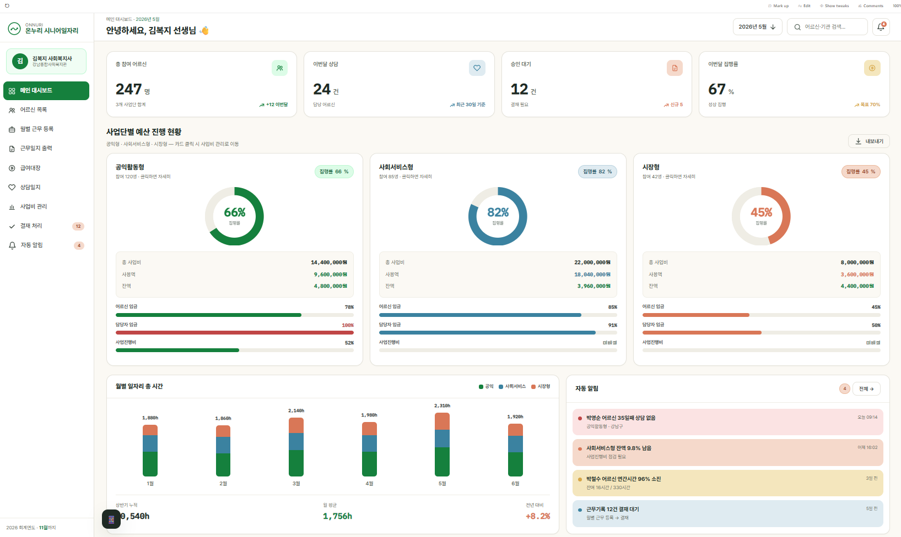
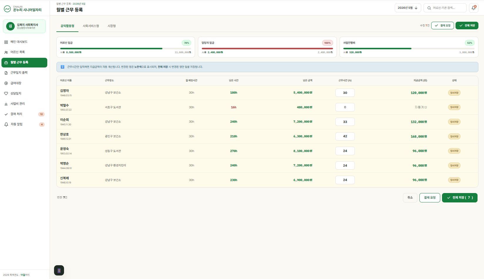
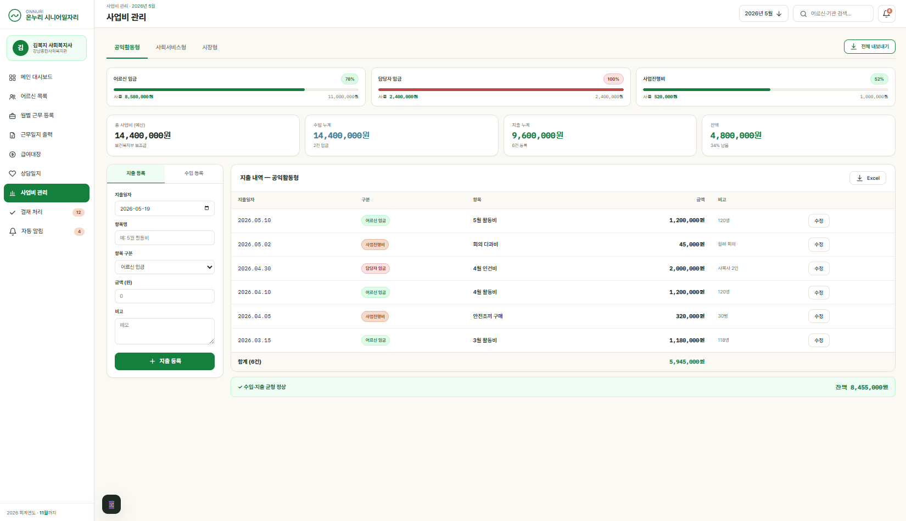

# Senior Jobs — 노인일자리사업 통합 관리 SaaS

> 한국 노인일자리사업의 참여자 관리·근무 기록·급여·사업비·산출물 생성을 하나로 묶은 **멀티테넌트 SaaS**입니다.
> 복잡한 정부 사업 규정을 코드로 강제하고, 수기·엑셀로 흩어져 있던 행정 업무를 자동화하는 것을 목표로 합니다.

<p>
  
  
  
  
  
</p>

---

## 프로젝트 한눈에 보기

| 항목 | 내용 |
|---|---|
| **유형** | 멀티테넌트 B2B SaaS (웹 애플리케이션) |
| **도메인** | 한국 노인일자리사업 행정 관리 (공익활동형 / 사회서비스형 / 시장형) |
| **백엔드** | Python · FastAPI · SQLAlchemy 2.0 (async) · PostgreSQL · Redis · Celery |
| **프론트엔드** | React 19 · TypeScript · Vite · TailwindCSS · Zustand |
| **품질** | 자동화 테스트 **246개**, 커버리지 **91.85%** |
| **규모** | 백엔드 모듈 70+ 파일 · 도메인 테이블 15개 · API 라우터 14개 |

---

## 어떤 문제를 푸는가

노인일자리사업은 사업단 유형마다 **근무 시간 한도·세션 규칙·급여 산정·사업비 정산 기준이 모두 다르고**, 그 규정을 위반한 데이터는 정부 보고 시 반려됩니다. 현장에서는 이를 엑셀과 수기로 관리하다 보니 다음과 같은 문제가 반복됩니다.

- 유형별 시간 한도(공익활동형 월 42h, 1회 4h 등)를 사람이 일일이 검증
- 시급 변경 시 과거 지급액까지 잘못 재계산되는 사고
- 12월 데이터 입력 등 규정 위반 데이터의 사후 발견
- 기관(테넌트)별 데이터가 섞일 위험

**Senior Jobs는 이 규정들을 코드 레벨에서 강제하여, 잘못된 데이터가 애초에 저장되지 못하게 합니다.**

---

## 주요 기능

- **참여자(어르신) 관리** — 등록·수정·이력 관리, 소프트 삭제 기반 데이터 보존
- **근무 기록 워크플로우** — `DRAFT → SUBMITTED → APPROVED / REJECTED` 상태 전이, 결재 라인
- **근무 시간 자동 계산·검증** — 사업단 유형별 월/회 한도, 연간 총시간, 점진 조정(7월~) 로직
- **급여 산정** — 시급 변경 시 과거 지급액 불변 보장(규정 준수)
- **사업비 관리** — 예산 대비 집행 자동 연동, 대시보드 시각화(Recharts)
- **산출물 생성** — 근무일지·정산 자료를 Excel(openpyxl)·PDF(reportlab)로 비동기 생성(Celery) 후 오브젝트 스토리지(MinIO) 저장
- **상담 일지 / 감사 로그(Audit Log)** — 모든 주요 변경 이력 추적
- **권한 관리(RBAC)** — 6단계 역할 계층, 기관별 데이터 격리
- **대시보드** — 기관/사업단별 현황 집계, 모바일 반응형(900px 브레이크포인트)

---

## 시스템 아키텍처

```
┌──────────────────────────────┐        ┌───────────────────────────────────────┐
│   Frontend (React 19 + TS)   │        │            Backend (FastAPI)            │
│  ─ Vite / TailwindCSS        │  HTTPS │  ┌─────────┐  ┌──────────┐  ┌────────┐ │
│  ─ Zustand (상태관리)         │ ─────► │  │ Routers │─►│ Services │─►│ Models │ │
│  ─ Axios (API 계층)           │   JWT  │  └─────────┘  └──────────┘  └────────┘ │
│  ─ Recharts (시각화)          │        │       │ RBAC · Rule Engine · Audit      │
└──────────────────────────────┘        └───────┼─────────────────────────────────┘
                                                 │
              ┌──────────────────────────────────┼───────────────────────────┐
              ▼                  ▼                ▼              ▼             ▼
        ┌───────────┐     ┌──────────┐    ┌────────────┐  ┌─────────┐  ┌──────────┐
        │PostgreSQL │     │  Redis   │    │   Celery   │  │  MinIO  │  │  Sentry  │
        │ (+ RLS)   │     │ 캐시/제한 │    │ 비동기 작업 │  │ 파일저장 │  │ 에러추적  │
        └───────────┘     └──────────┘    └────────────┘  └─────────┘  └──────────┘
```

- **Router → Service → Model** 3계층 분리로 비즈니스 로직을 라우터에서 격리
- **멀티테넌시**: 모든 주요 테이블에 `tenant_id` + PostgreSQL **Row-Level Security(RLS)** 로 기관 간 데이터 물리 격리
- **비동기 처리**: 무거운 산출물 생성은 Celery 워커로 위임, API 응답성 확보

---

## 기술 스택

**Backend**
`FastAPI` `SQLAlchemy 2.0 (async)` `PostgreSQL` `Alembic` `Redis` `Celery` `Pydantic v2` `JWT(python-jose)` `passlib/bcrypt` `slowapi(rate limit)` `MinIO` `openpyxl` `reportlab` `structlog` `Sentry`

**Frontend**
`React 19` `TypeScript` `Vite` `TailwindCSS` `Zustand` `Axios` `Recharts`

**Infra / Tooling**
`Docker Compose` `pytest (246 TC, 91.85% cov)` `ESLint`

---

## 기술적으로 신경 쓴 부분

채용 관점에서 단순 CRUD를 넘어 고민한 지점들입니다.

### 1. PostgreSQL Row-Level Security 기반 멀티테넌시
애플리케이션 코드의 `WHERE tenant_id = ?` 누락에 의존하지 않고, **DB 레벨 RLS 정책**으로 테넌트 격리를 보장했습니다. 슈퍼유저가 RLS를 우회하는 함정까지 파악해 테스트에서 `SET LOCAL ROLE`로 실제 격리를 검증했습니다.

### 2. 비동기 ORM과 마이그레이션 드라이버 분리
런타임은 `asyncpg`로 비동기 처리하되, Alembic 마이그레이션은 multi-statement DDL을 처리하지 못하는 asyncpg의 한계 때문에 **동기 드라이버(psycopg2)로 자동 전환**하도록 설계했습니다.

### 3. 규정의 코드화 (불변 규칙)
- 12월 데이터 입력 차단을 **API(422) + DB CHECK 제약** 이중으로 강제
- 시급 변경 시 과거 지급액 재계산 금지
- 소프트 삭제(`deleted_at`)만 허용, 물리 삭제 차단
- 규정 변경에 유연하게 대응하기 위한 **Rule Engine** 도입

### 4. 인증·보안
- JWT 액세스/리프레시 토큰 분리
- **로그인 5회 실패 시 15분 IP 차단** (Redis + slowapi)
- 6단계 RBAC 역할 계층(`platform_admin > tenant_admin > social_worker = approver > auditor > viewer`)

### 5. 설정·시크릿 관리
모든 비밀값을 코드에서 제거하고 `.env` 단일 소스로 통합, Docker(전체 URL 주입)와 로컬(컴포넌트 조립) 양쪽 실행을 모두 지원하도록 구성했습니다.

### 6. 테스트 주도 품질 관리
도메인 단위 → Phase 게이트 순으로 진행하며 **246개 자동화 테스트 / 91.85% 커버리지**를 유지했습니다. 규정 검증 로직(근무 시간·실현 가능성)은 경계값까지 전용 테스트 케이스로 검증했습니다.

---

## 로컬 실행 방법

> Docker Compose로 PostgreSQL·Redis·MinIO·백엔드·Celery를 한 번에 띄웁니다.

```bash
# 1) 환경변수 준비
cp .env.example .env
# .env 안의 비밀번호(changeme 등)와 SECRET_KEY를 실제 값으로 교체

# 2) 인프라 + 백엔드 기동
docker compose up -d

# 3) DB 마이그레이션 (asyncpg 제약으로 호스트에서 실행)
cd backend && alembic upgrade head

# 4) 프론트엔드 개발 서버
cd frontend && npm install && npm run dev
```

- API 문서(Swagger): `http://localhost:8000/docs`
- 프론트엔드: `http://localhost:5173`

```bash
# 테스트 실행
cd backend && pytest --cov=app
```

---

## 프로젝트 구조

```
senior-jobs/
├── backend/
│   ├── app/
│   │   ├── core/        설정·보안·DB·테넌트·로깅
│   │   ├── models/      도메인 테이블 (15개)
│   │   ├── schemas/     Pydantic 스키마
│   │   ├── routers/     API 엔드포인트 (14개)
│   │   ├── services/    비즈니스 로직 (라우터와 분리)
│   │   ├── tasks/       Celery 비동기 태스크
│   │   └── utils/       Excel·PDF 생성, 스토리지
│   ├── alembic/         DB 마이그레이션
│   └── tests/           unit · integration (246 TC)
├── frontend/
│   └── src/
│       ├── pages/       화면 단위 컴포넌트
│       ├── components/  공통·레이아웃 컴포넌트
│       ├── hooks/       데이터 페칭 훅
│       ├── services/    API 호출 계층 (axios)
│       └── stores/      전역 상태 (Zustand)
└── docker-compose.yml
```

---

## 스크린샷

**대시보드 — 기관/사업단별 현황 집계**


**월별 근무 등록 — 유형별 시간 한도 자동 검증**


**사업비 관리 — 예산 대비 집행 연동**


---

## 참고

본 저장소는 포트폴리오 목적으로 공개되었습니다. 실제 정부 사업 데이터는 포함되어 있지 않으며, `.env`의 모든 비밀값은 예시(placeholder)입니다.
